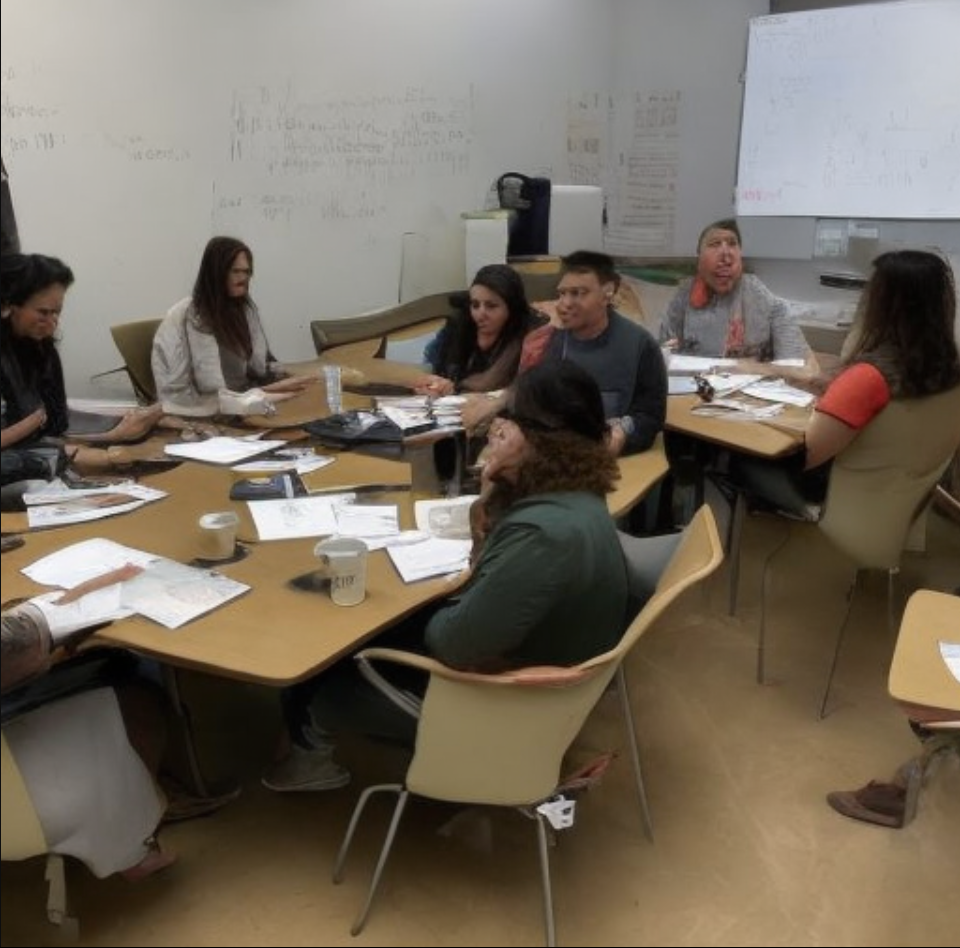
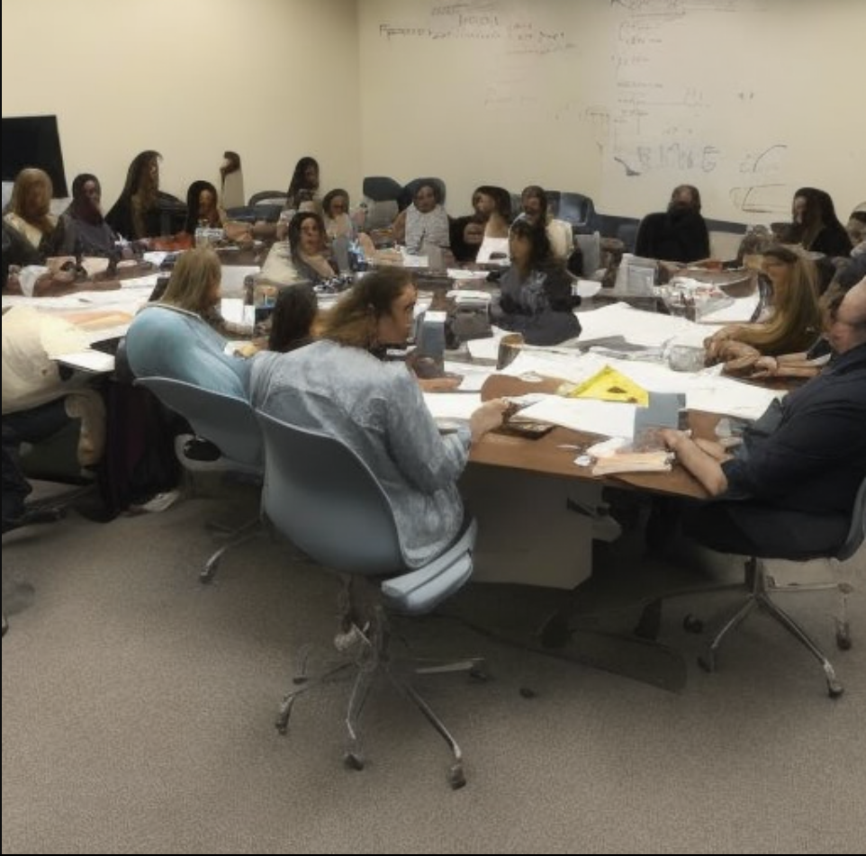
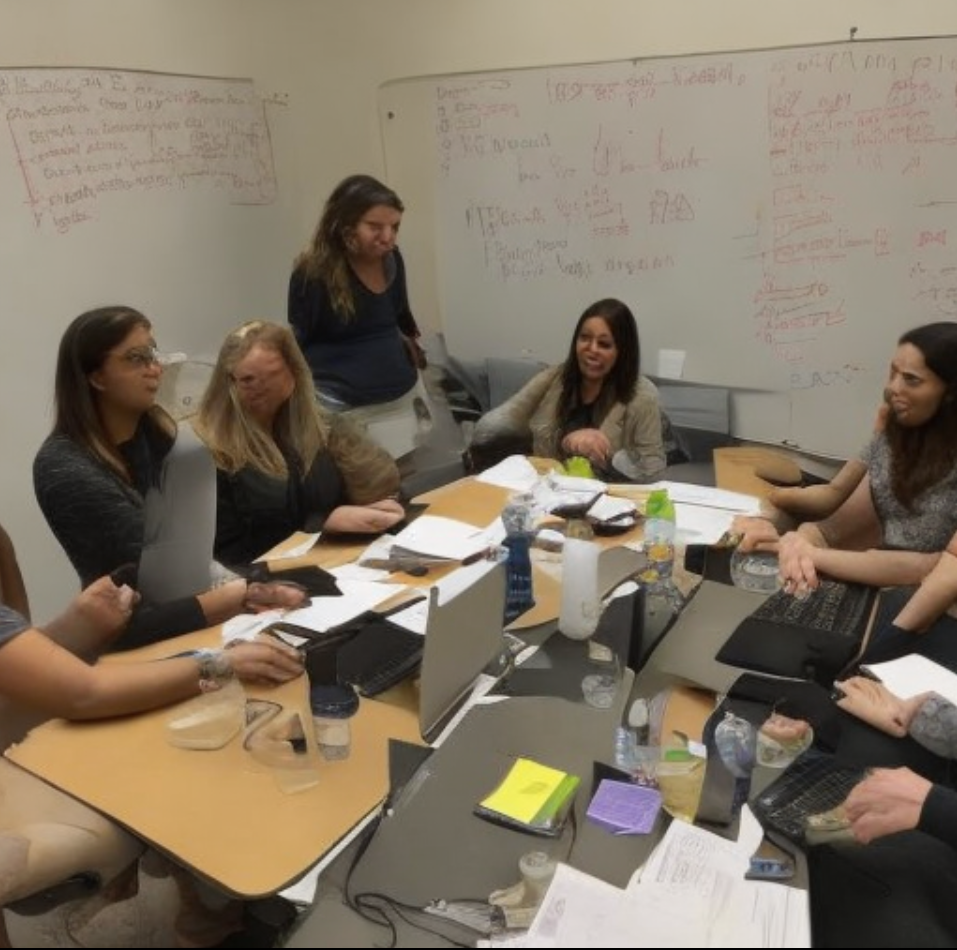

# Task1: Build T2I model

- Model I use is [Stable Diffusion](https://github.com/ShivamShrirao/diffusers). Read [paper here](https://paperswithcode.com/paper/high-resolution-image-synthesis-with-latent)


# GET STARTED

* Create environment:
```
conda create --name stable_diffusion
conda activate stable_diffusion
```

* Install some dependencies
```
pip install -qq git+https://github.com/ShivamShrirao/diffusers
pip install -q -U --pre triton
pip install -q accelerate transformers ftfy bitsandbytes==0.35.0 gradio natsort safetensors xformers
```


* Prepare data
  - here I use a subset `classroom` (300 images) from [Lsun dataset](https://github.com/fyu/lsun)

  ```
  git clone https://github.com/fyu/lsun.git
  python3 download.py -c classroom
  
  ```
  - then run `prepare_data` to save configure for dataset. The code like this:
  
  ```
  concepts_list = [
      {
          "instance_prompt":      "photo of student activitiy in school", # the general prompt for all image in my dataset
          "class_prompt":         "school",                               # the class name of them
          "instance_data_dir":    "/content/school_concept",              # path to folder
          "class_data_dir":       "/content/data/school"                  
      },
      # if dataset have more category (image), append the concepts list like this:
      #     {
      #         "instance_prompt":      "photo of ukj person",
      #         "class_prompt":         "photo of a person",
      #         "instance_data_dir":    "/content/data/ukj",
      #         "class_data_dir":       "/content/data/person"
      #     }
  ]
  
  import json
  import os
  for c in concepts_list:
      os.makedirs(c["instance_data_dir"], exist_ok=True)
  
  with open("concepts_list.json", "w") as f:
      json.dump(concepts_list, f, indent=4) #save configure
  ```
    

* Fine-tune a Stable Diffusion model

  - run the script `scripts/fintune.sh`:

  ```
  mkdir -p ~/.huggingface
  HUGGINGFACE_TOKEN = "*******" # token taken from Huggingface (free 100%)
  echo -n "${HUGGINGFACE_TOKEN}" > ~/.huggingface/token
  
  MODEL_NAME = "stable-diffusion-v1-5" 
  OUTPUT_DIR = "./weights"            #forder to save model
  mkdir -p $OUTPUT_DIR
  
  
  # start running model
  python3 train_dreambooth.py \
    --pretrained_model_name_or_path=$MODEL_NAME \
    --pretrained_vae_name_or_path="stabilityai/sd-vae-ft-mse" \           # we used the pretrain model to avoid training from scratch
    --output_dir=$OUTPUT_DIR \
    --revision="fp16" \                                    
    --with_prior_preservation --prior_loss_weight=1.0 \
    --seed=1337 \
    --resolution=256 \                                                    #default is 512 but I had to reduce to 256 because of resource limitation
    --train_batch_size=1 \
    --train_text_encoder \
    --mixed_precision="fp16" \                                            # use this arg to speed up training
    --use_8bit_adam \                                                     # use this arg to save Ram memory
    --gradient_accumulation_steps=1 \
    --learning_rate=1e-6 \
    --lr_scheduler="constant" \
    --lr_warmup_steps=0 \
    --num_class_images=50 \                                               
    --sample_batch_size=4 \
    --max_train_steps=8000 \                                              # Depend on the length of dataset
    --save_interval=50 \
    --save_sample_prompt="photo of student activity" \
    --concepts_list="concepts_list.json"                                  # `--save_sample_prompt` can be same as `--instance_prompt` to generate intermediate samples (saved along with weights in samples directory).
  
  ```

* Convert checkpoint file to ckpt file:

```
WEIGHTS_DIR = "your_saved_folder"
ckpt_path = WEIGHTS_DIR + "/model.ckpt"  # save path

half_arg=""

fp16 = True  #Whether to convert to fp16, takes half the space (2GB).
if fp16:
    half_arg="--half"


python convert_diffusers_to_original_stable_diffusion.py --model_path $WEIGHTS_DIR  --checkpoint_path $ckpt_path $half_arg

```

  U can download my model file [here](https://drive.google.com/file/d/1-9vB4rej23ertZBrCbm-5OMq8TG35R-W/view?usp=drive_link)
  
# Test fine-tuned Stable Diffusion model

- inference by saved weight file:

```
python infer.py --weight_path <your path>  --prompt "a math class" --outdir <your path> -H 256 -W 256 -n-samples 4
```

- samples








* The number of model parameters to determine the model’s complexity : 2.1G

*  The model evaluation metric (The one you calculated in the code, not the paper stated one) 

  I used MSE loss to compute the difference between the source image and fake image 

  ```
                      # Chunk the noise and model_pred into two parts and compute the loss on each part separately.
                      model_pred, model_pred_prior = torch.chunk(model_pred, 2, dim=0)
                      target, target_prior = torch.chunk(target, 2, dim=0)
  
                      # Compute instance loss
                      loss = F.mse_loss(model_pred.float(), target.float(), reduction="mean")
  
                      # Compute prior loss
                      prior_loss = F.mse_loss(model_pred_prior.float(), target_prior.float(), reduction="mean")
  
                      # Add the prior loss to the instance loss.
                      loss = loss + args.prior_loss_weight * prior_loss
  
  ```
