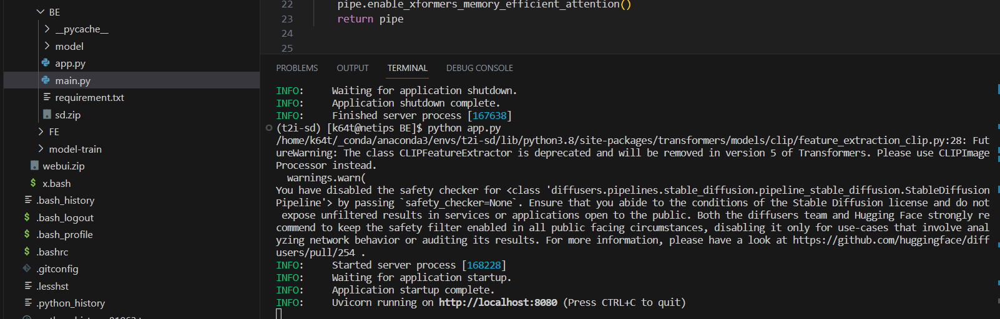
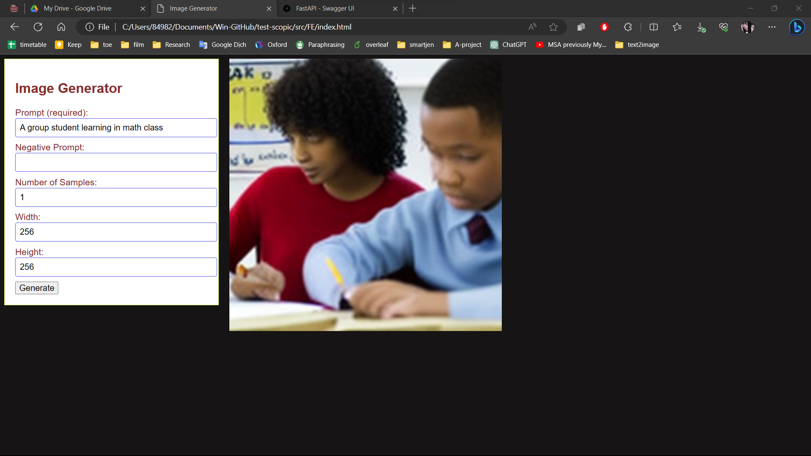
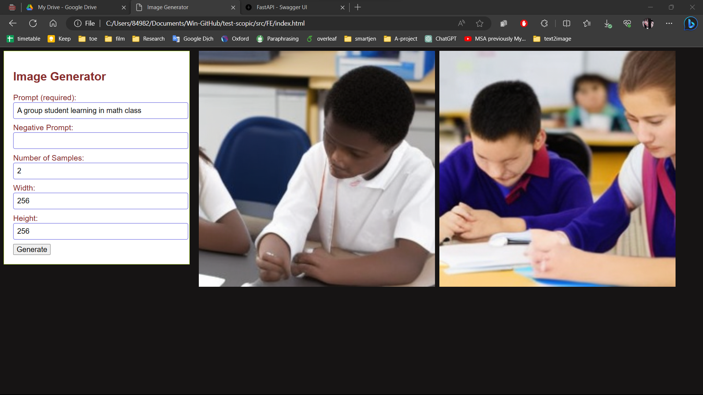

# **Task 2.** Using the model in a web application

## The source codes : 
  - [web](webUI).
  - Dirtionary Contruction: I seperate into 2 branch:
    - BE : contain code use in server. call ML model to generate image from text and return client.
    - FE : contain code (html, js, css).


## Instruction 

* **Backend Side**

  - create environment
    ```
    cd webUI/backend
    conda create --name backend
    conda activate backend
    pip install -r requirements.txt
    ```
  - next, download and unzip the model file( [original file](https://drive.google.com/file/d/10xHlUk_CzyyaFdSOZt2mYvA6onhbhjKm/view?usp=sharing) ) inside folder BE
  - then, run server by:
    ```bash
    cd webUI/backend
    conda activate backend
    python app.py
    ```
    + note that, in `main.py`, you have to specify exacly where model folder is
  
    ```
    #CONSTANTs
    MODEL_PATH = "./models" #your folder path containning your model. model_index.json, config
    if not os.path.exists(MODEL_PATH): raise TypeError("MODEL PATH not exists")
    ```
  - if model is loaded, you will get the result like this:

  


* **Frontend Side**

In frontend side, I just write basic page allow user to type `prompt`, `negative prompt`, `number of samples` and size of output.
when user click 'generate' button, he will receive corresponding images like:





